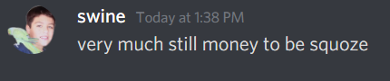
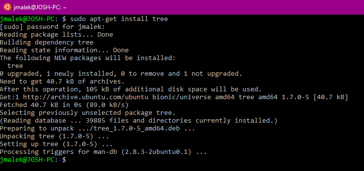
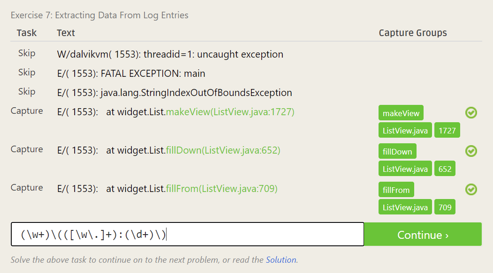
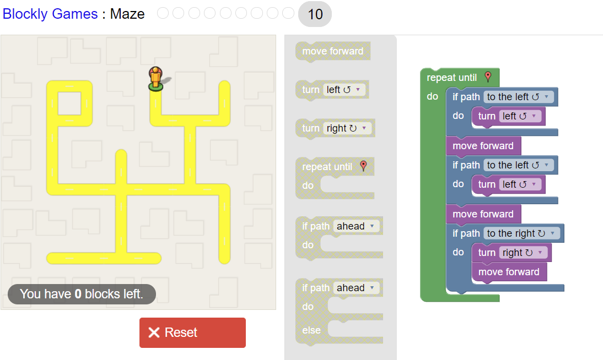

# Lab 01 Report - Introduction to Open Source Software

#### My suggestions for How to answer Questions in a helpful way:

Provide strong documentation in cases of disagreement with answer

Consider edge cases and don't be too quick to jump to conclusions

#### My thoughts on Chapter 3 of Free Culture

  We've always known that large corporations are increasingly inconsiderate of the common people, even more so to make a point.  In this case of Jesse vs. the RIAA, the lawsuit was just the RIAA lawyers flexing the incredibly stringent copyright law they themselves had written and lobbied.  Picking on the little man, and willing to settle for the entire net worth of a college student to make a point is simply another day, and the cost of the publicity is worth the opportunity to make an example out of a largely innocent victim.  In recent days especially, we've seen that when it comes down to the common man and corporations, they don't care about you.  

  Robinhood and other brokers have shown their true colors lately, when faced with the opportunity to support the 99%, they chose to throw in lots with the 1%.  And when push comes to shove, it will happen again.  People like Jesse are innocent, and I'm not sure the same thing could happen in today's society and the incredible stopping power of social media.  If this case came out again today, people like Jesse might have more power against corporations just trying to make an example.

### Linux

#### Tree Install

### Regex

#### 7 problems SS

#### 4 crossword problems

### Blockly

#### Blockly Maze 10 Solution

### Reflection

For finding an open source project, I read through the various provided materials and thought more on my own open source experience in RCOS.  I enjoy working on projects that I have background knowledge on, or try to mitigate an issue I have real world experience with.  I feel like I wouldn't enjoy working on some random system level project, trying to optimize code or something like that.  Obviously I would have to start small with the project, and familiarize, but eventually I want to be able to provide meaningful contributions to a project I would personally enjoy.  I think for in terms of how I can find this project, I could possibly search through GitHub for topics I'm interested in, such as eSports, data analytics, game mods, or potentially housing or eCommerce projects.  I know this casts a very wide net, but I do have more interests outside of these that I would probably search as well.  I could also potentially search through opensource.google with the same purposes.