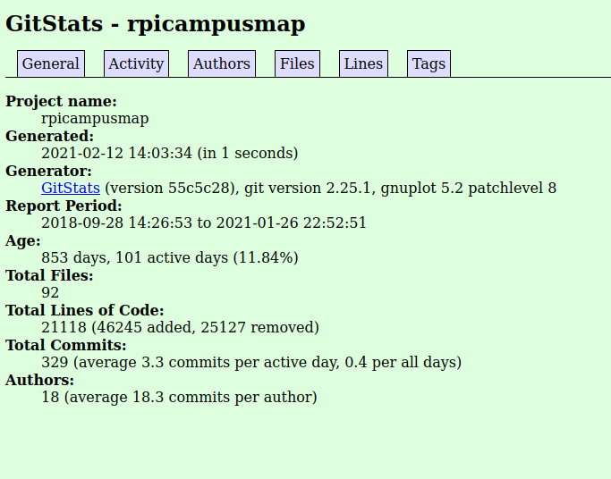
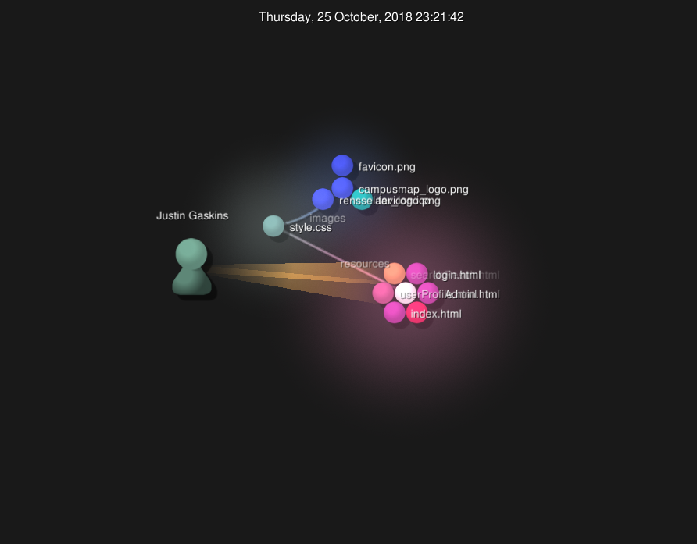

## The Hotbox

the number of contributors: 9 contributors

number of lines of code: 1014 lines

the first commit: Sep 11, 2020

the latest commit: Dec 8, 2020

the current branches: There are 6 current branches

### Gitstats

The Gitstats output page seems to correlate pretty well with my findings, the lines of code is a bit off but I guess that's to be expected.

### Gource

## Shuttle Tracker
- Contributors: 33
- Lines of code: ~62,000
- [Initial commit](https://github.com/wtg/shuttletracker/commit/3453b12cb6d53080a0967644eddf44111fef0c54) on January 27, 2015 by gbprz
- [Latest commit](https://github.com/wtg/shuttletracker/commit/3e8b9af6a7d8b341b605f137cf2b4577edd6bed3) on December 4, 2020 by MattCzyr
- Branches: 55

The results of `gitstats` are a bit different than the stats from `git`, but
they're in the same ballpark. For example, 33 contributors vs. 39 contributors,
and ~62,000 lines of code vs. ~53,000 lines of code.

Screenshot of `gource`:

## Offcmpus

## RPI Campus Map 

10 Contributors

37207 total lines of code (achieved by git ls-files -z | xargs -0 wc -l )

First Commit: Fri Sep 28 14:26:53 2018

Last Commit: Tue Jan 26 22:52:51 2021

Branches: master (one branch)

### GitStats

After running GitStats, we note a difference in the Contributors, also denoted as Authors.
GitStats reports that there are 18 Authors when Git only revealed 10. Further, the Git command on line 5 of this document yielded 37207 lines of code in Rpi Campus Map; GitStats yielded 21118 lines of code (46245 added, 25127 removed).

### Gource

